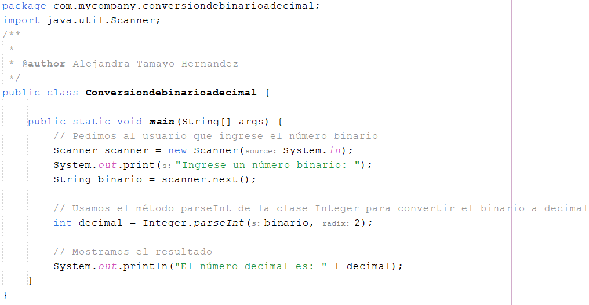

<!-- No borrar o modificar -->
[Inicio](./index.md)

## Sesión 11 


<!-- Su documentación aquí -->

# Actividad: Ejercicios de Lógica de programación 

1. Basándose en el algoritmo 1 de la sesión 11, aplique la siguiente variante: Dado un conjunto de números enteros, se debe determinar si existe algún número que aparezca más de una vez. Si es así, se deben imprimir todos los números que aparezcan más de una vez.

2. Desarrollar un algoritmo que realiza la conversión de binario a decimal.

# DESARROLLO

1. `Algoritmo 1`

``` java 
public class Ejercicio1 {

    public static void main(String[] args) {
        // Declaramos un conjunto de números enteros
        int[] numeros = {1, 2, 3, 4, 5, 2};

        // Creamos una variable para almacenar el número que aparece más de una vez
        int numeroRepetido = 0;

        // Recorremos el conjunto de números
        for (int i = 0; i < numeros.length; i++) {
            // Comprobamos si el número actual ya ha aparecido
            for (int j = 0; j < i; j++) {
                if (numeros[i] == numeros[j]) {
                    // El número actual ya ha aparecido
                    numeroRepetido = numeros[i];
                    break;
                }
            }
        }

        // Si el número repetido es distinto de 0, lo imprimimos
        if (numeroRepetido != 0) {
            System.out.println("El número repetido es: " + numeroRepetido);
        } else {
            // No hay ningún número repetido
            System.out.println("No hay ningún número repetido");
        }
    }
}
```


2. `Algoritmo que realiza la conversión de binario a decimal:`



Este algoritmo solicita al usuario que ingrese un número binario y luego utilice el método `parseInt` de la clase `Integer` para realizar la conversión binaria a decimal. El segundo argumento en `parseInt` es la base numérica en la que se encuentra el número original, en este caso, "2" para binario.


