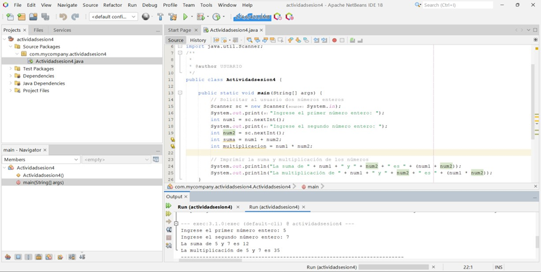
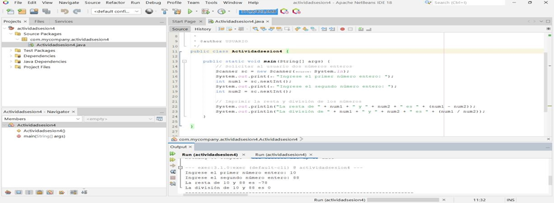
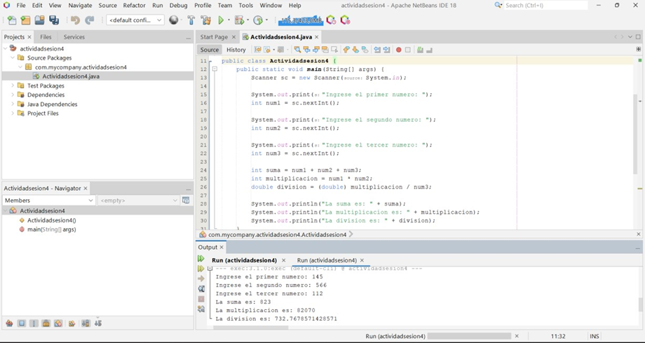
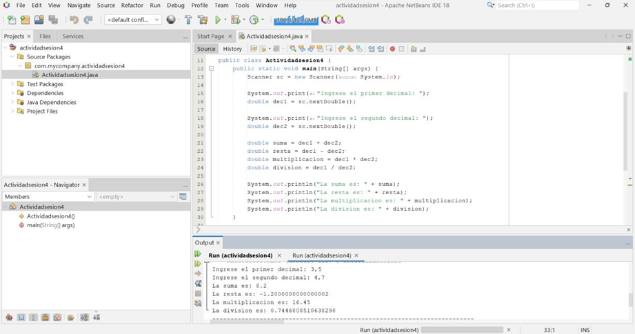
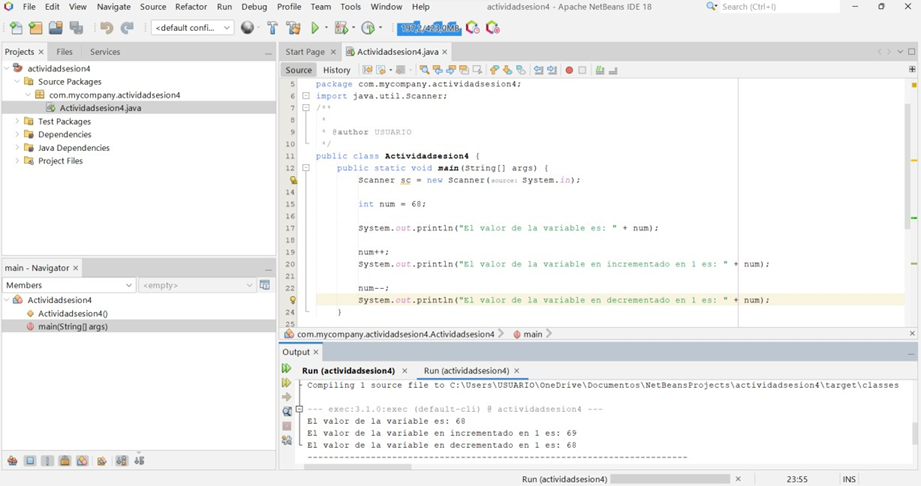
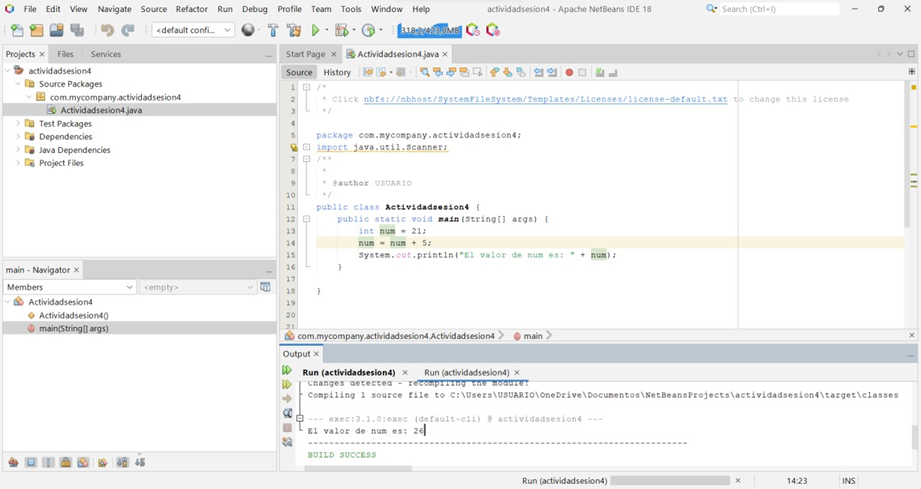
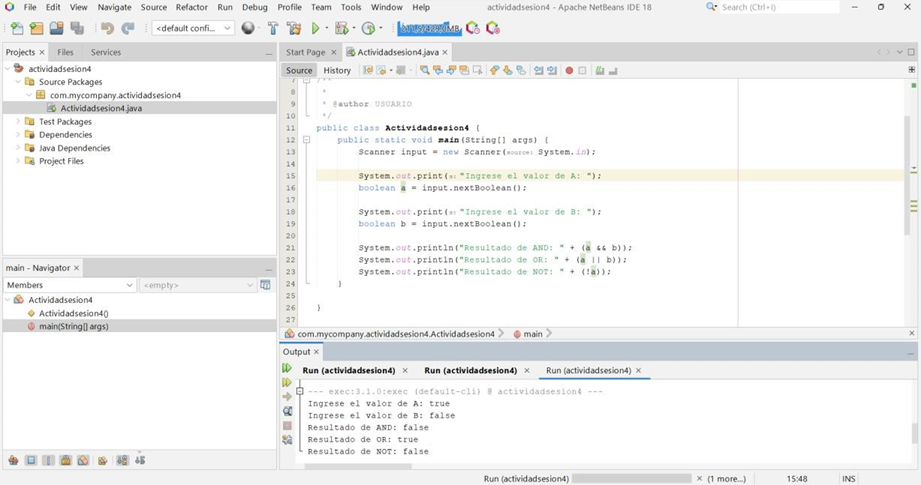
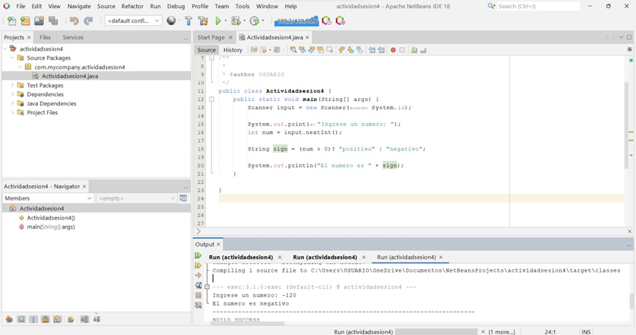

<!-- No borrar o modificar -->
[Inicio](./index.md)

## Sesión 3 

<!-- Su documentación aquí -->

# Actividad Sesión 3: Ejercicios de operaciones básicas en Java.

**1. Suma y multiplicación:** Escribe un programa que solicite al usuario dos números enteros y luego imprima la suma y multiplicación de esos números.

**2. Resta y división:** Escribe un programa que tome dos números enteros ingresados por el usuario y calcule la resta y división de esos números.

**3. Operaciones combinadas:** Escribe un programa que solicite al usuario tres números enteros y realice las siguientes operaciones: suma de los tres números, multiplicación del primer número por el segundo y división del resultado entre el tercer número.

**4. Operaciones con decimales:** Escribe un programa que solicite al usuario dos números decimales y realice las siguientes operaciones: suma, resta, multiplicación y división.

**5. Incremento y decremento:** Escribe un programa que declare una variable entera y la inicialice con un valor. Luego, incrementa su valor en 1 y muestra el resultado. Después, decrementa su valor en 1 y muestra el resultado nuevamente.

**6. Operador de asignación compuesta:** Escribe un programa que declare una variable entera y la inicialice con un valor. Utiliza el operador de asignación compuesta para sumar 5 a la variable y luego mostrar su valor.

**7. Operadores lógicos:** Escribe un programa que tome dos valores booleanos ingresados por el usuario y muestre el resultado de las operaciones lógicas AND, OR y NOT entre esos valores.

**8. Operador ternario:** Escribe un programa que tome un número entero ingresado por el usuario y utilice el operador ternario para determinar si el número es positivo o negativo. Luego, muestra el resultado en la salida.

# DESARROLLO

1. 

2. 

3. 

4. 

5. 

6. 

7. 

8. 

