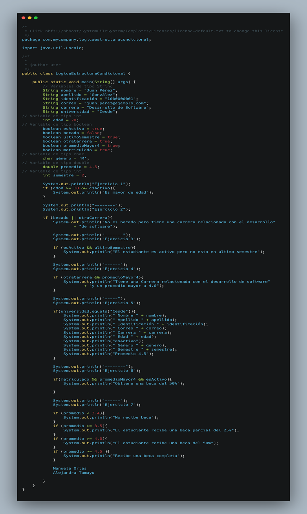

<!-- No borrar o modificar -->
[Inicio](./index.md)

## Sesión 4


<!-- Su documentación aquí -->

# Actividad Sesión 4: Ejercicios de control de flujo con expresiones compuestas

```java
// Variables de tipo String
String nombre = "Juan Pérez";
String apellido = "González";
String identificación = "1000000001";
String correo = "juan.perez@ejemplo.com";
String carrera = "Desarrollo de Software";
String universidad = "Cesde";
// Variable de tipo int
int edad = 20;
// Variable de tipo boolean
boolean esActivo = true;
boolean becado = false;
// Variable de tipo char
char género = 'M';
// Variable de tipo double
double promedio = 4.5;
// Variable de tipo int
int semestre = 2;
```


**Con la información anterior, implementa los siguientes ejercicios:**

1. Determinar si el estudiante es mayor de edad y tiene un estado activo.
2. Determinar si el estudiante tiene una beca o una carrera relacionada con el desarrollo de software.
3. Determinar si el estudiante está en el último semestre de su carrera y tiene un estado activo.
4. Determinar si el estudiante tiene una carrera relacionada con el desarrollo de software y un promedio superior a 4.0.
5. Mostrar toda la información del estudiante si está matriculado en el Cesde.
6. Asignar una beca del 50% si el estudiante está matriculado en el Cesde, tiene un promedio superior a 4.0 y está activo.
Determinar la cantidad de beca que recibe el estudiante según su promedio:
0.0 - 3.4: El estudiante no recibe beca.
3.5 - 3.9: El estudiante recibe una beca parcial del 25%.
4.0 - 4.4: El estudiante recibe una beca parcial del 50%.
4.5 - 5.0: El estudiante recibe una beca completa.

# DESARROLLO




