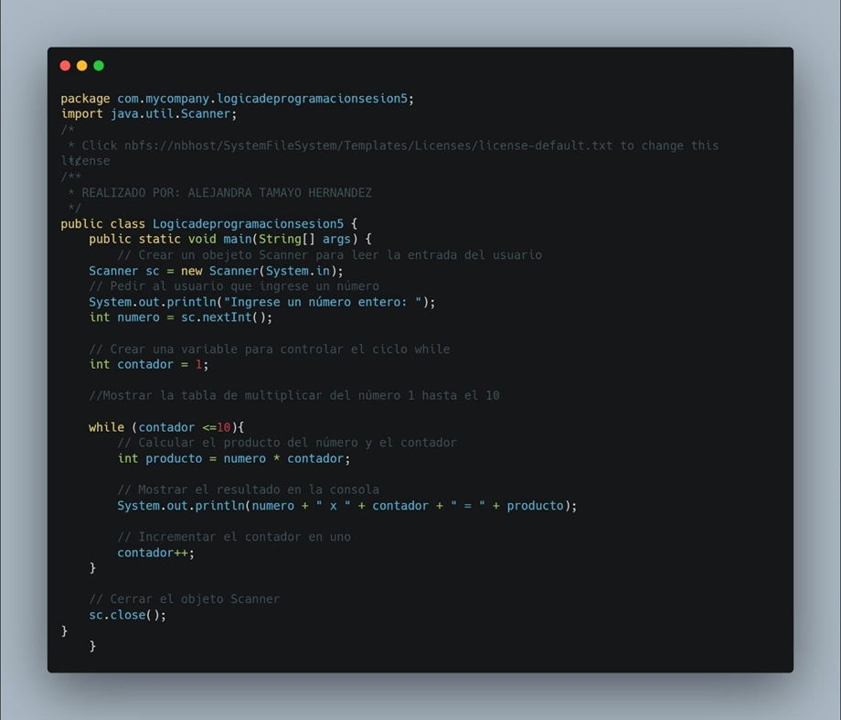
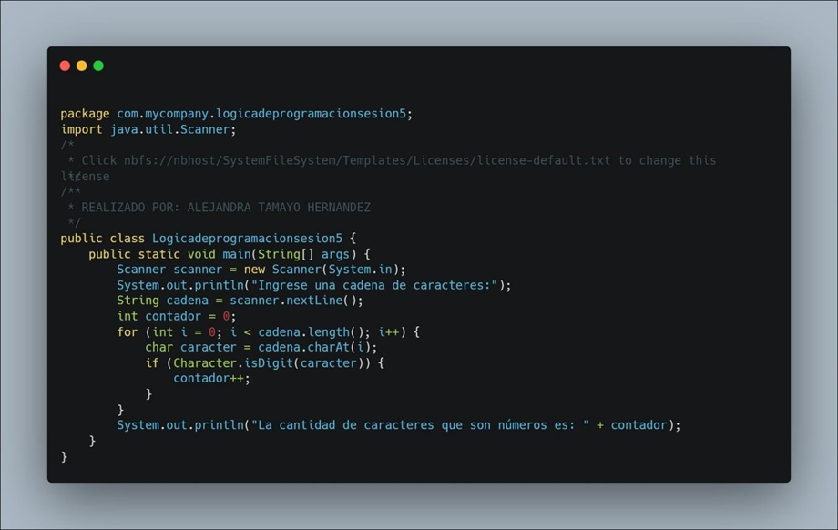
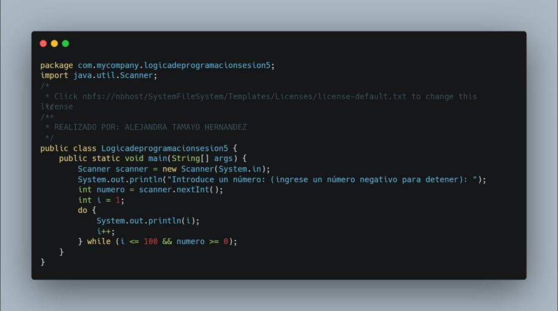
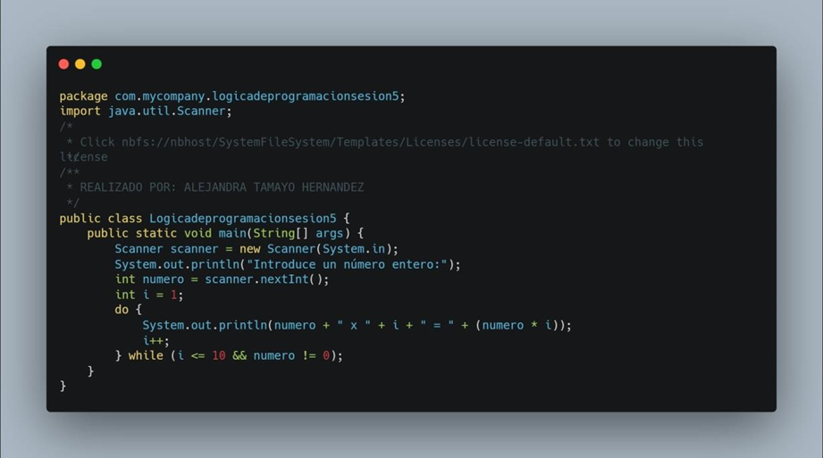
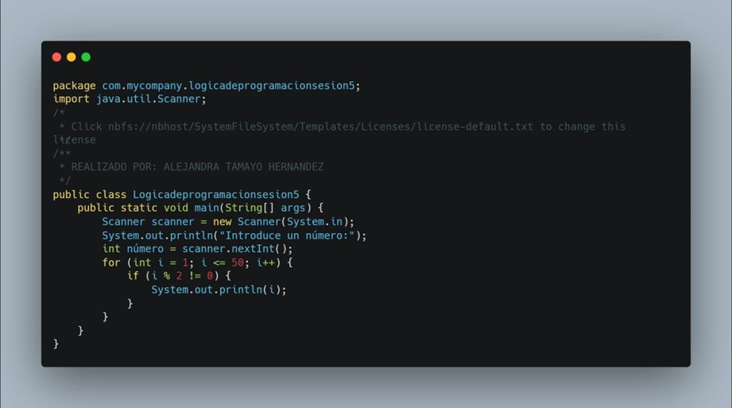
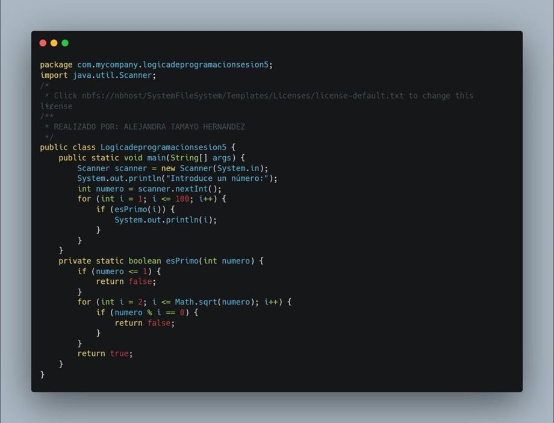

<!-- No borrar o modificar -->
[Inicio](./index.md)

## Sesión 5 

<!-- Su documentación aquí -->

# Actividad Sesión 5: Ejercicios de bucles

Resolver los siguientes ejercicios:

**1. Ejercicios - while**

- Pedir al usuario que ingrese un número y mostrar su tabla de multiplicar hasta el número 10.

- Pedir al usuario que ingrese una cadena de caracteres y contar la cantidad de caracteres que son números.

**2. Ejercicios - do while**

- Escribe un programa en Java que imprima los números del 1 al 100, pero que se detenga si el usuario introduce un número negativo.

- Escribe un programa en Java que pida al usuario un número entero e imprima la tabla de multiplicar de ese número, pero que se detenga si el usuario introduce el número 0.

**3. Ejercicios - for**

- Imprimir los números impares del 1 al 50.

- Imprimir los números primos del 1 al 100.

