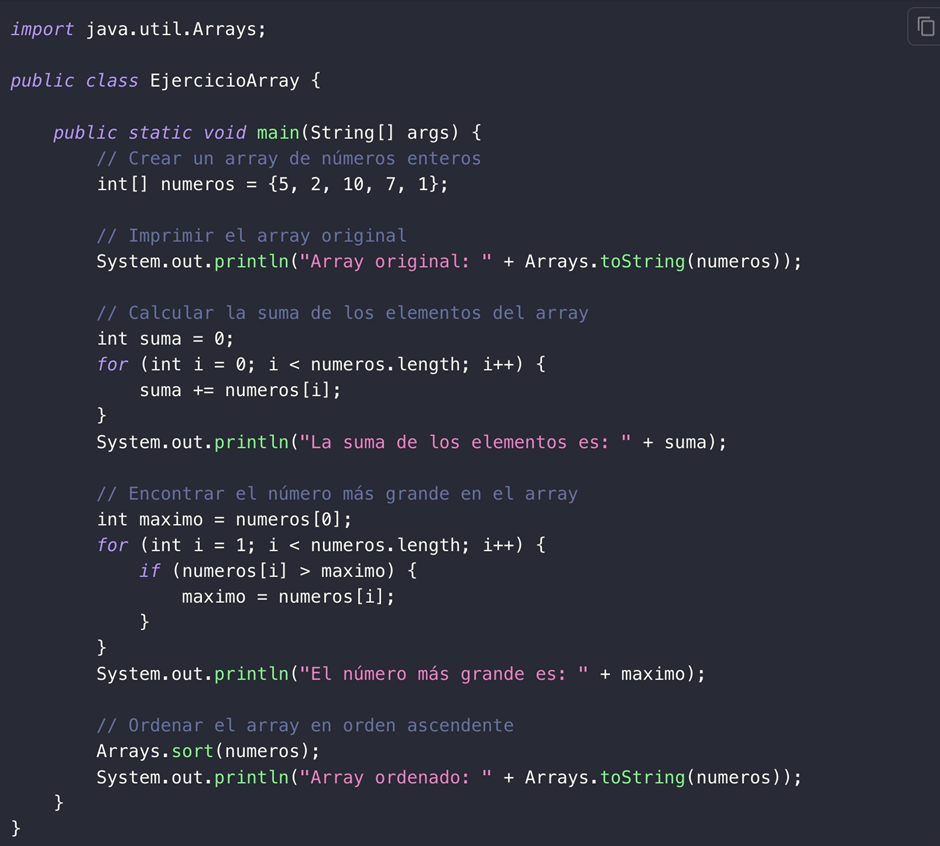
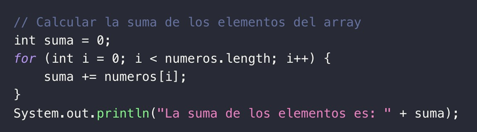
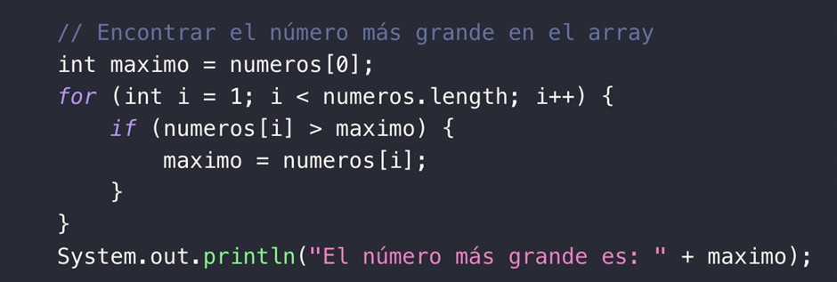
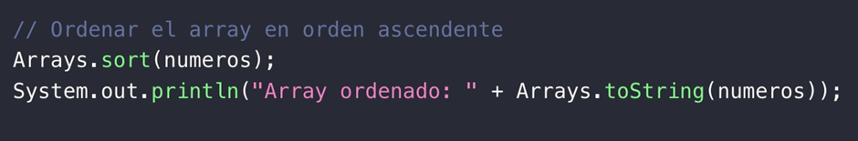
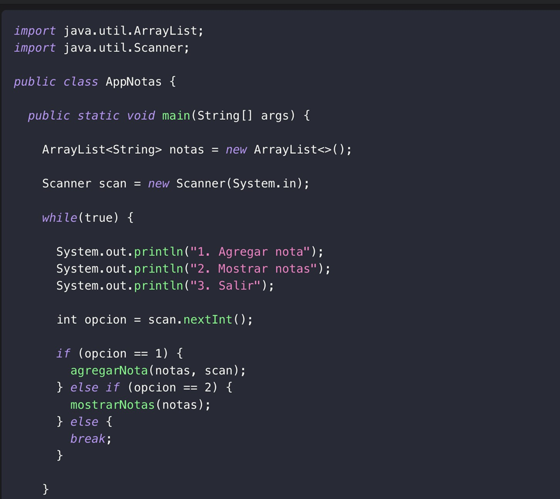
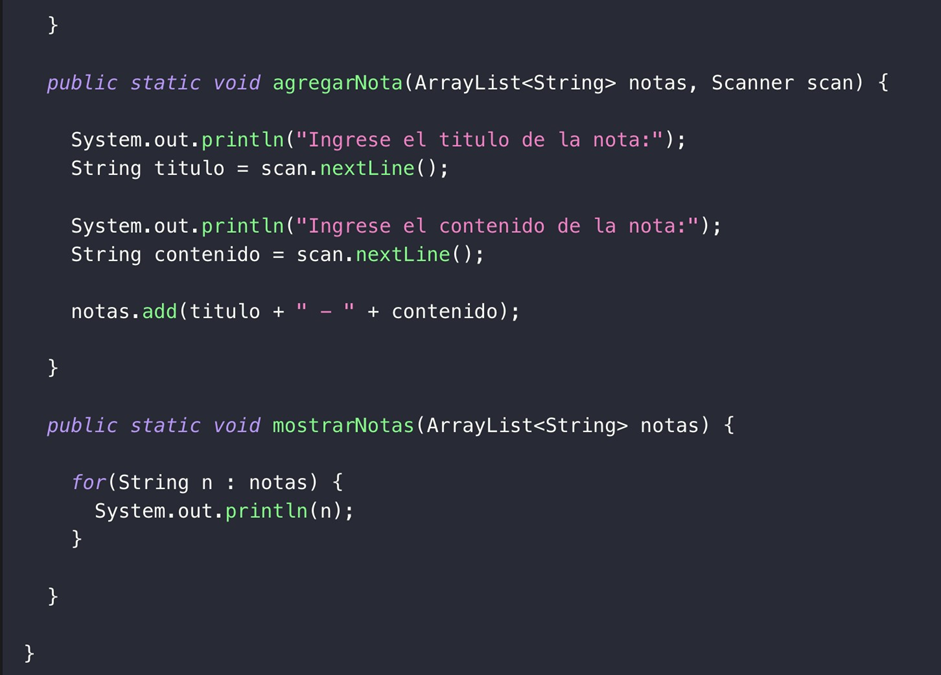

<!-- No borrar o modificar -->
[Inicio](./index.md)

## Sesión 7 


<!-- Su documentación aquí -->

# Actividad: Ejecicios Array - ArrayList

1. En parejas, probar, analizar y explicar el funcionamiento de los siguientes ejemplos de Array y ArrayList.

2. Crear un ejemplo de Array y otro de ArrayList para visualizar sus diferencias.

# DESARROLLO

## Actividad Sesión 7: Ejercicios Array - ArrayList

1. En parejas, probar, analizar y explicar el funcionamiento de los siguientes ejemplos de Array y ArrayList.



El código en java realiza 2 tareas:



Imprime el contenido de un array llamado números.

Calcula la suma de los elementos en esa matriz y luego imprime el resultado de la suma.

Esta línea imprime el contenido del array números. Utiliza
Arrays.toString (números) para convertir el array en una cadena de caracteres legibles que muestra todos los elementos del array. La salida será algo como: Luego, el código procede a calcular la suma de los elementos en el array:



El código funciona recorriendo un array para comparar cada iteración con una variable llamada máximo para así poder mantener un registro del número más grande que se encuentra hasta el momento.

En resumen, este código es una forma válida de encontrar el número más grande en un array en Java y funcionará correctamente siempre que el array contenga al menos un elemento.



Este código se utiliza para ordenar el array números en orden ascendente, para luego imprimir el resultado ordenado.

### Ejemplo Array list





El ArrayList llamado `notas` es para almacenar las notas. Cada elemento del ArrayList es una cadena de caracteres que contiene el título y el contenido de una nota.

Se inicia un bucle `while(true)` que se ejecutará continuamente hasta que el usuario seleccione la opción "Salir" (opción 3).

En cada iteración del bucle, se muestra un menú con tres opciones: "Agregar nota" (opción 1), "Mostrar notas" (opción 2) y "Salir" (opción 3).

Se utiliza `scan.nextInt()` para leer la opción elegida por el usuario.

Si el usuario elige la opción 1 ("Agregar nota"), se llama a la función `agregarNota()` para ingresar el título y el contenido de la nota y luego se agrega la nota al ArrayList `notas`.

Si el usuario elige la opción 2 ("Mostrar notas"), se llama a la función `mostrarNotas()` para mostrar todas las notas almacenadas en el ArrayList.

Si el usuario elige la opción 3 ("Salir"), el bucle `while` se interrumpe y el programa finaliza.

Las funciones `agregarNota()` y `mostrarNotas()` son simples. `agregarNota()` permite al usuario ingresar el título y el contenido de la nota y luego agrega una cadena formateada al ArrayList `notas`. 

`mostrarNotas()` itera a través de todas las notas almacenadas en `notas` e imprime cada una de ellas.

### Ejercicio Array

``` java
import java.util.Arrays;
/**
*
* @author user
*/
public class Sesion8 { public static void main(String[] args) { int[] datos = {8, 2, 10, 6, 9, 12, 4, 3};
System.out.println("Array original: " + Arrays.toString(datos));
int suma = 0; for (int i = 0; i < datos.length; i++) {
suma += datos[i];
}
System.out.println("La suma de los elementos es: " + suma);
int maximo = datos[0]; for (int i = 1; i < datos.length; i++) {
if (datos[i] > maximo) {
maximo = datos[i];
}
}
System.out.println("El número más grande es: " + maximo);
Arrays.sort(datos);
System.out.println("Array ordenado: " + Arrays.toString(datos));
}
}
```


