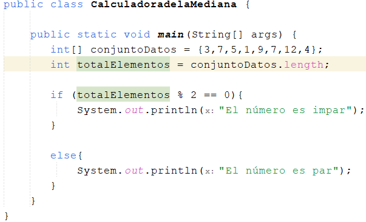

<!-- No borrar o modificar -->
[Inicio](./index.md)

## Sesión 9 

<!-- Su documentación aquí -->

# Actividad: Ejecicios de métodos en Java

Resolver en parejas el ejercicio asignado por el docente

# DESARROLLO

